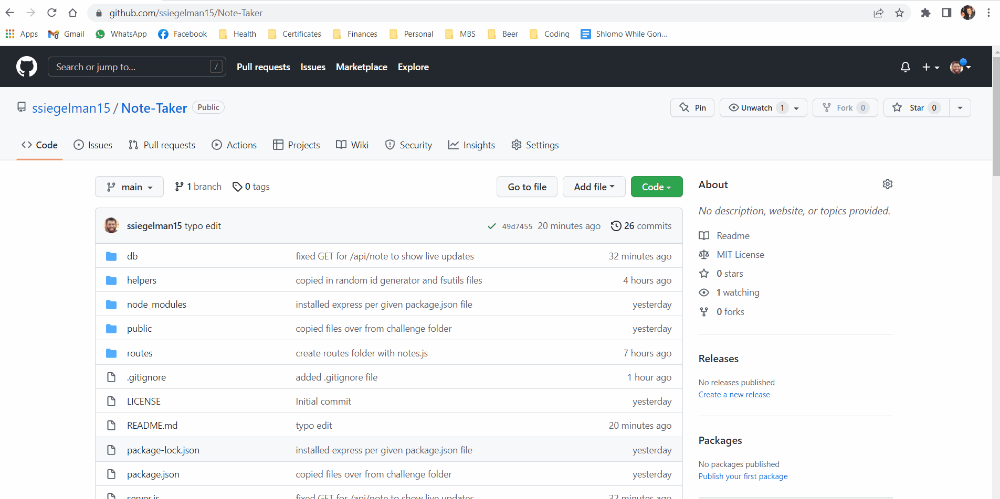

# Note Taker

  ## Table of Contents
- [Description](#description)
- [Technologies Used](#technologies)
- [Website in Action](#usage)
- [Installation](#installation)
- [Usage](#usage)
- [Contributing](#contributing)
- [Questions](#questions)
- [License](#license)

## Description

Note Taker is an application that uses Express.js to store notes in a database file and present them on the front end for viewing or deletion.

## Technologies Used

- HTML5
- CSS3
- Bootstrap
- JavaScript
- Node.js
- Express.js

## Website in Action

## Installation

Clone the repository and run "npm i" from the terminal to install necessary files.

## Usage

Please see the below link for the deployed website:

https://calm-ravine-16134.herokuapp.com/

## Contributing

Please provide your Github username and email.

## Questions

Please send any questions or comments you have to ssiegelman15@gmail.com or visit the following page: [GitHub](https://github.com/ssiegelman15)

## License

Permission is hereby granted, free of charge, to any person obtaining a copy of this software and associated documentation files (the "Software"), to deal in the Software without restriction, including without limitation the rights to use, copy, modify, merge, publish, distribute, sublicense, and/or sell copies of the Software, and to permit persons to whom the Software is furnished to do so, subject to the following conditions: 
The above copyright notice and this permission notice shall be included in all copies or substantial portions of the Software. 
THE SOFTWARE IS PROVIDED "AS IS", WITHOUT WARRANTY OF ANY KIND, EXPRESS OR IMPLIED, INCLUDING BUT NOT LIMITED TO THE WARRANTIES OF MERCHANTABILITY, FITNESS FOR A PARTICULAR PURPOSE AND NONINFRINGEMENT. 
IN NO EVENT SHALL THE AUTHORS OR COPYRIGHT HOLDERS BE LIABLE FOR ANY CLAIM, DAMAGES OR OTHER LIABILITY, WHETHER IN AN ACTION OF CONTRACT, TORT OR OTHERWISE, ARISING FROM, OUT OF OR IN CONNECTION WITH THE SOFTWARE OR THE USE OR OTHER DEALINGS IN THE SOFTWARE. 

For more info, please visit [MIT License](https://choosealicense.com/licenses/mit/).

